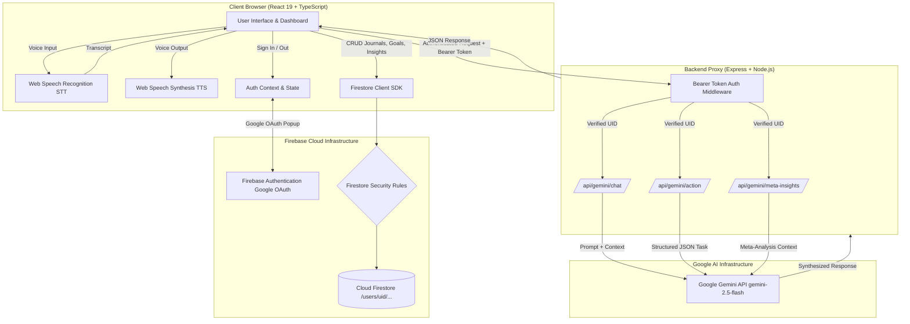
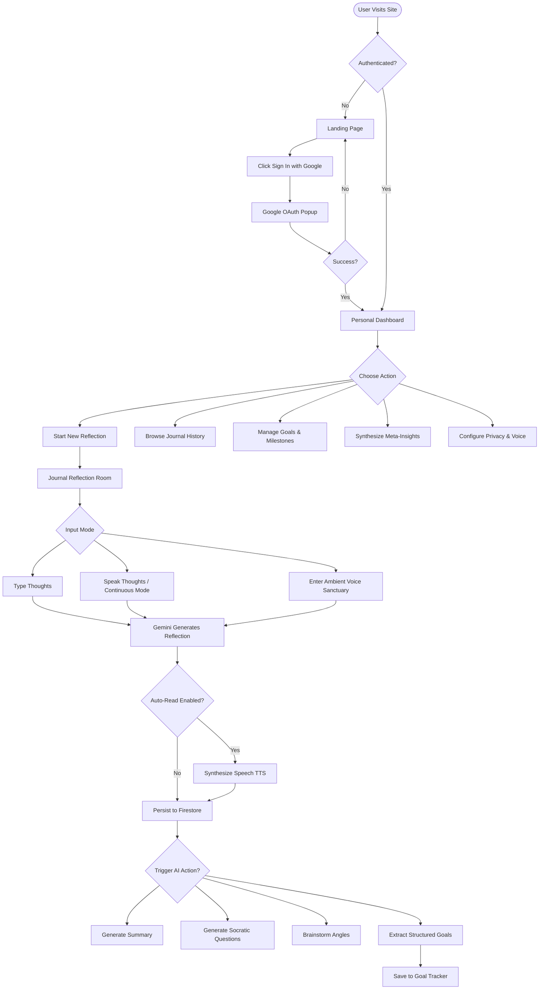
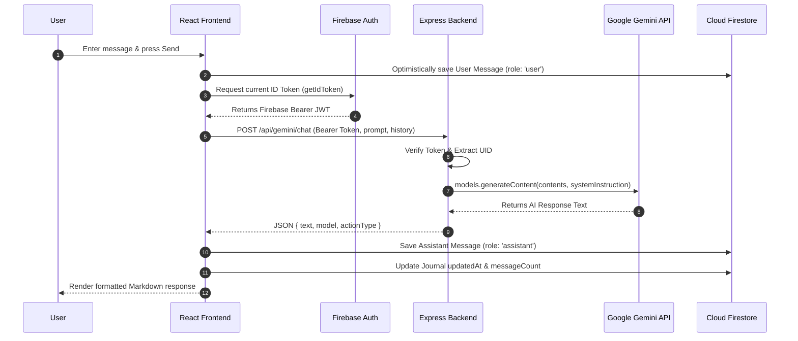
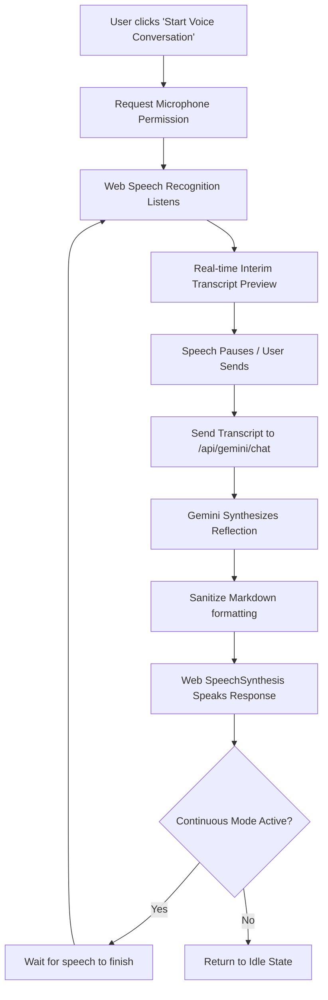
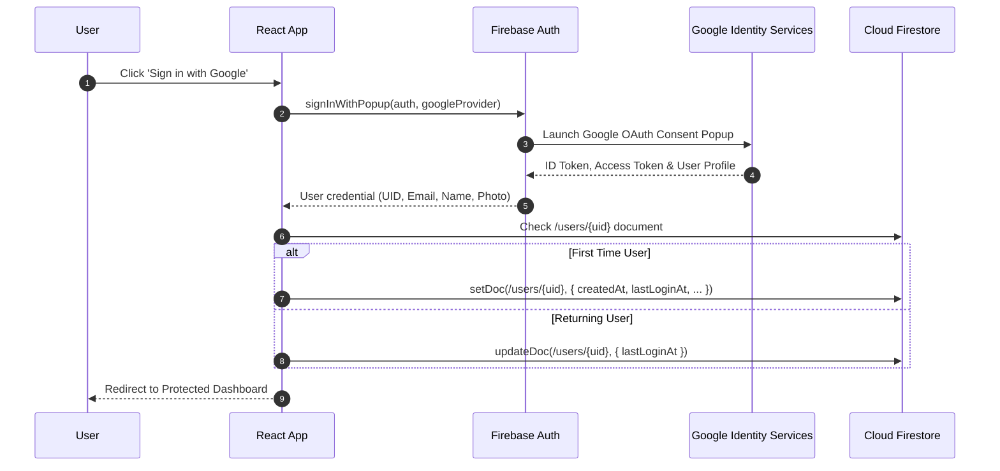

# AI Journal & Reflection

> A private, user-authenticated AI journaling and reflection companion powered by Google Gemini, Firebase Authentication, Cloud Firestore, and multimodal voice interaction.

[](https://nodejs.org)
[](https://www.typescriptlang.org/)
[](https://react.dev/)
[](https://firebase.google.com/)
[](https://ai.google.dev/)
[](https://tailwindcss.com/)

---

## ⚡ Quick Start

```bash
# 1. Clone repository
git clone <YOUR_GITHUB_REPOSITORY_URL>
cd ai-journal-reflection

# 2. Install dependencies
npm install

# 3. Configure environment variables
cp .env.example .env.local
# Edit .env.local with your GEMINI_API_KEY and Firebase client keys

# 4. Start local development server
npm run dev

# 5. Open in browser
# Navigate to http://localhost:3000 and sign in with Google
```

---

## 📖 Table of Contents

1. [Project Overview](#-project-overview)
2. [Key Features](#-key-features)
3. [Technology Stack](#-technology-stack)
4. [System Architecture](#-system-architecture)
5. [User Flow Diagrams](#-user-flow-diagrams)
6. [Authentication Flow](#-authentication-flow)
7. [Firestore Data Architecture](#-firestore-data-architecture)
8. [User Data Isolation & Security Model](#-user-data-isolation--security-model)
9. [Voice Interaction Architecture](#-voice-interaction-architecture)
10. [API Reference](#-api-reference)
11. [Environment Variables](#-environment-variables)
12. [Local Installation & Setup Guide](#-local-installation--setup-guide)
13. [Firebase Setup Walkthrough](#-firebase-setup-walkthrough)
14. [Gemini AI Configuration](#-gemini-ai-configuration)
15. [Manual Testing Procedures](#-manual-testing-procedures)
16. [Cross-User Security Verification](#-cross-user-security-verification)
17. [Troubleshooting Guide](#-troubleshooting-guide)
18. [Production Deployment](#-production-deployment)
19. [Project Highlights](#-project-highlights)
20. [Future Scope](#-future-scope)

---

## 🌟 Project Overview

**AI Journal & Reflection** is a full-stack personal reflection sanctuary built to help individuals explore their thoughts, process emotional challenges, organize creative ideas, and convert introspections into actionable goals.

### The Problem
Traditional journaling apps are passive text repositories: they require users to write into an empty vacuum without feedback, synthesis, or structured growth tracking. Conversely, standard chatbots lack persistent data isolation, personal context recall, and structured developmental tools.

### The Solution
This platform bridges mindful introspection and artificial intelligence:
* **Private Sanctuary**: End-to-end user isolation powered by Firebase Auth and strict Cloud Firestore security rules.
* **Server-Side AI Processing**: Direct integration with Google Gemini (`gemini-2.5-flash`) through secure Express backend proxies that protect API credentials.
* **Multimodal Voice Dialogue**: Real-time browser speech recognition (STT) and dynamic speech synthesis (TTS) with an ambient voice reflection sanctuary.
* **Intelligent Synthesis**: Instant extraction of actionable goals, recurring emotional themes, and longitudinal meta-analyses across past journals.

---

## ✨ Key Features

### 🔐 Authentication & Privacy
* **Google OAuth Sign-In**: Native popup authentication via Firebase Authentication (`GoogleAuthProvider`).
* **Session Persistence**: Automatic local session management with token refresh.
* **Strict User Isolation**: All Firestore operations strictly enforced at `/users/{userId}/...` path boundaries.
* **Data Ownership & Export**: One-click full JSON data backup and local export.

### 📝 Intelligent Journaling & Multi-Turn Chat
* **Structured Reflection Modes**: Daily Journal, Reflection, Career, Study, Ideas, Goals, Projects, General.
* **Mood Tracking**: 5-point emotional cadence tracking (*Great*, *Good*, *Okay*, *Difficult*, *Low*).
* **Multi-Turn Contextual Dialogue**: Gemini retains the multi-turn conversational history within each journal.
* **Tagging & Search**: Fast client-side keyword filtering and category segmentation.
* **Journal Lifecycle**: In-place renaming, category switching, archiving, and permanent deletion with cascade cleanup.

### 🧠 Gemini AI Capabilities
* **Interactive Reflection**: Deep, non-judgmental conversational partner adhering to strict reflective guidelines.
* **Executive Summarization**: Markdown breakdown covering Core Focus, Realizations, Concerns, and Takeaways.
* **Socratic Reflection Prompts**: 3–4 open-ended questions designed to examine subconscious assumptions.
* **Creative Brainstorming**: Grouped idea generation across immediate wins, creative angles, and long-term milestones.
* **Structured Goal Extraction**: Converts freeform thought transcripts into structured JSON goals with discrete task checklists.
* **Meta-Analysis Synthesis**: Longitudinal analysis across all historical journals identifying growth trajectories and recommendations.

### 🎙️ Voice & Speech Interaction
* **Hands-Free Reflection**: Native speech recognition via Web Speech API (`webkitSpeechRecognition` / `SpeechRecognition`).
* **Interactive Speech Synthesis**: Natural text-to-speech with clean markdown sanitization.
* **Continuous Conversational Mode**: Automatic microphone reactivation after Gemini finishes speaking for natural back-and-forth dialogue.
* **Voice Sanctuary Room**: Immersive, full-screen audio reflection mode featuring an ambient breathing orb visualizer.
* **Voice Customization**: Accents (`en-US`, `en-IN`, `en-GB`, `en-AU`, `en-CA`), adjustable speech rates (0.7x–1.5x), pitch tuning, and voice selection.

### 🎯 Goal Tracking & Actionable Milestones
* **Step-by-Step Task Checklists**: Checkable subtasks with dynamic progress calculation.
* **Status Lifecycles**: *Not Started*, *In Progress*, *Completed*.
* **Direct AI Goal Import**: One-click import from AI reflection chat directly into the goal tracker.

---

## 🛠️ Technology Stack

| Layer | Technology | Version | Purpose |
| :--- | :--- | :--- | :--- |
| **Frontend UI** | React | `19.0.1` | Declarative component hierarchy and reactivity |
| **Language** | TypeScript | `~5.8.2` | Strict end-to-end type safety |
| **Styling** | Tailwind CSS | `^4.1.14` | High-performance utility styling & dark theme |
| **Animations** | Motion | `^12.23.24` | Smooth transitions, modal animations, audio waveforms |
| **Icons** | Lucide React | `^0.546.0` | Crisp vector icons |
| **Markdown** | React-Markdown + Remark-GFM | `10.1.0` / `4.0.1` | Rich formatted output rendering |
| **Backend Server** | Express | `^4.21.2` | RESTful API proxy and authentication middleware |
| **AI Integration** | `@google/genai` | `^2.4.0` | Official Google Gen AI TypeScript SDK |
| **AI Model** | `gemini-2.5-flash` | — | High-speed, high-reasoning reflection and JSON extraction |
| **Authentication** | Firebase Auth | `^12.18.0` | Google Identity Services authentication |
| **Database** | Cloud Firestore | `^12.18.0` | Cloud NoSQL document store with strict rules |
| **Voice STT** | Web Speech Recognition API | Native Browser | Zero-cloud audio transcription |
| **Voice TTS** | SpeechSynthesis API | Native Browser | Natural local speech synthesis |
| **Bundler & Dev** | Vite + tsx + esbuild | `^6.2.3` / `^4.21.0` | Fast dev server and CommonJS production build |

---

## 📐 System Architecture



---

## 🔄 User Flow Diagrams

### Complete User Journey



### Text & Reflection Chat Pipeline



### Multimodal Voice Flow & Continuous Dialogue



---

## 🔑 Authentication Flow



---

## 🗄️ Firestore Data Architecture

All data is structured strictly within user-scoped subcollections to guarantee cryptographic isolation:

```text
databases/{database}/documents/
└── users/
    └── {userId}/                           # Root user document
        ├── email: string
        ├── displayName: string
        ├── photoURL: string
        ├── lastLoginAt: string (ISO)
        ├── createdAt: string (ISO)
        │
        ├── journals/                       # Subcollection: User Journals
        │   └── {journalId}/
        │       ├── id: string
        │       ├── userId: string
        │       ├── title: string
        │       ├── category: string
        │       ├── tags: string[]
        │       ├── summary: string (optional)
        │       ├── mood: string (optional)
        │       ├── archived: boolean
        │       ├── messageCount: number
        │       ├── createdAt: string (ISO)
        │       ├── updatedAt: string (ISO)
        │       ├── serverCreatedAt: Timestamp
        │       ├── serverUpdatedAt: Timestamp
        │       │
        │       └── messages/               # Nested Subcollection: Messages
        │           └── {messageId}/
        │               ├── id: string
        │               ├── role: "user" | "assistant" | "system"
        │               ├── content: string
        │               ├── actionType: string
        │               ├── timestamp: string (ISO)
        │               └── serverTimestamp: Timestamp
        │
        ├── goals/                          # Subcollection: Goals
        │   └── {goalId}/
        │       ├── id: string
        │       ├── userId: string
        │       ├── journalId: string (optional)
        │       ├── title: string
        │       ├── description: string
        │       ├── status: "Not Started" | "In Progress" | "Completed"
        │       ├── category: string (optional)
        │       ├── targetDate: string (optional)
        │       ├── tasks: Array<{ id: string, text: string, completed: boolean }>
        │       ├── createdAt: string (ISO)
        │       └── updatedAt: string (ISO)
        │
        └── insights/                       # Subcollection: Meta-Insights
            └── {insightId}/
                ├── id: string
                ├── userId: string
                ├── type: "theme" | "pattern" | "reflection" | "milestone"
                ├── title: string (optional)
                ├── content: string
                ├── journalId: string (optional)
                └── createdAt: string (ISO)
```

---

## 🛡️ User Data Isolation & Security Model

```mermaid
flowchart LR
    subgraph User_A_Space ["User A's Boundary (UID_A)"]
        UA[User A Session] -->|Allowed| FA[/users/UID_A/...]
        FA --> DA[(User A Private Journals & Goals)]
    end

    subgraph User_B_Space ["User B's Boundary (UID_B)"]
        UB[User B Session] -->|Allowed| FB[/users/UID_B/...]
        FB --> DB[(User B Private Journals & Goals)]
    end

    UA -.->|❌ BLOCKED by Firestore Rules| FB
    UB -.->|❌ BLOCKED by Firestore Rules| FA
```

### Firestore Security Rules (`firestore.rules`)

```javascript
rules_version = '2';
service cloud.firestore {
  match /databases/{database}/documents {
    // Strict User Data Isolation: Users can only access their own user document and subcollections
    match /users/{userId} {
      allow read, write: if request.auth != null && request.auth.uid == userId;
      
      match /{allSubcollections=**} {
        allow read, write: if request.auth != null && request.auth.uid == userId;
      }
    }
  }
}
```

* **No Global Collections**: There are no unauthenticated or shared root collections.
* **Granular Auth Verification**: Every document read, query, creation, update, or deletion evaluates `request.auth.uid == userId`.
* **Subcollection Cascade**: `{allSubcollections=**}` guarantees that nested messages, goals, and insights inherit strict parent ownership rules.

---

## 🎤 Voice Interaction Architecture

### 1. Speech Recognition (Speech-to-Text)
* Utilizes the browser's native `webkitSpeechRecognition` or `SpeechRecognition` constructor.
* Configured with `continuous = false` and `interimResults = true` for responsive real-time feedback.
* Automatic silence detection pauses listening and commits the transcribed text.

### 2. Speech Synthesis (Text-to-Speech)
* Employs the browser's native `window.speechSynthesis`.
* Supports voice selection, pitch modulation (0.8–1.2), speed adjustments (0.7x–1.5x), and locale selection (`en-US`, `en-IN`, `en-GB`, `en-AU`, `en-CA`).

### 3. Markdown-to-Speech Sanitization
Before reading text aloud, the assistant executes regular expression sanitization to remove Markdown syntax (headers, asterisks, bullet points, code blocks) so the speech engine sounds natural without reciting syntax symbols.

### 4. Audio Privacy Guarantee
* **Zero Audio Uploads**: Microphone audio streams are transcribed purely in-browser via native Web Speech APIs.
* **No Raw Audio Files Stored**: Neither raw voice recordings nor audio blobs are uploaded to Firestore or external servers. Only the final transcribed text is sent to the server for Gemini processing.

---

## 📡 API Reference

All AI endpoints require a Firebase Authentication Bearer ID Token in the `Authorization` header.

### 1. Health Check
```http
GET /api/health
```
* **Authentication**: None
* **Response**:
```json
{
  "status": "ok",
  "timestamp": "2026-08-30T04:30:00.000Z",
  "geminiConfigured": true,
  "model": "gemini-2.5-flash"
}
```

---

### 2. Multi-Turn Reflection Chat
```http
POST /api/gemini/chat
```
* **Headers**: `Authorization: Bearer <FIREBASE_ID_TOKEN>`, `Content-Type: application/json`
* **Request Body**:
```json
{
  "prompt": "I'm feeling overwhelmed balancing my study schedule with personal projects.",
  "history": [
    { "role": "user", "content": "Hello" },
    { "role": "assistant", "content": "Welcome! What's on your mind today?" }
  ],
  "actionType": "chat"
}
```
* **Response**:
```json
{
  "text": "It is completely understandable to feel stretched when your academic goals collide with personal passions...",
  "model": "gemini-2.5-flash",
  "actionType": "chat"
}
```

---

### 3. Structured AI Action (Goals, Summaries, Prompts)
```http
POST /api/gemini/action
```
* **Headers**: `Authorization: Bearer <FIREBASE_ID_TOKEN>`, `Content-Type: application/json`
* **Request Body (Goal Extraction)**:
```json
{
  "action": "goals",
  "contextTitle": "Deep Work Planning",
  "category": "Career",
  "messages": [
    { "role": "user", "content": "I need to publish my portfolio by Friday and polish my resume." }
  ]
}
```
* **Response**:
```json
{
  "goals": [
    {
      "title": "Finalize Portfolio and Resume",
      "description": "Prepare professional materials for career outreach by end of week.",
      "tasks": [
        "Audit existing portfolio case studies",
        "Update resume technical skills section",
        "Deploy updated build to production"
      ]
    }
  ],
  "rawText": "..."
}
```

---

### 4. Meta-Insights Synthesis
```http
POST /api/gemini/meta-insights
```
* **Headers**: `Authorization: Bearer <FIREBASE_ID_TOKEN>`, `Content-Type: application/json`
* **Request Body**:
```json
{
  "journalSummaries": [
    { "title": "Morning Routine", "category": "Daily Journal", "summary": "Focused on morning meditation and deep work." },
    { "title": "Career Pivot Thoughts", "category": "Career", "summary": "Explored transitioning to distributed systems engineering." }
  ],
  "goalSummaries": [
    { "title": "Complete System Design Course", "status": "In Progress" }
  ]
}
```
* **Response**:
```json
{
  "metaAnalysis": "# 🌟 Reflection & Growth Synthesis\n\n## 🔍 Top Themes & Recurring Patterns\n..."
}
```

---

## ⚙️ Environment Variables

Create a `.env.local` file in your project root based on `.env.example`:

```env
# ==============================================================================
# SERVER-SIDE SECRETS (Never committed to GitHub or exposed in browser bundles)
# ==============================================================================
GEMINI_API_KEY="AIzaSyYourSecretGeminiApiKeyHere"
GEMINI_MODEL="gemini-3.7-flash"
APP_URL="http://localhost:3000"

# ==============================================================================
# CLIENT-SIDE CONFIGURATION (Public Firebase Web SDK credentials)
# ==============================================================================
VITE_FIREBASE_API_KEY="AIzaSyPublicFirebaseWebApiKey"
VITE_FIREBASE_AUTH_DOMAIN="your-project.firebaseapp.com"
VITE_FIREBASE_PROJECT_ID="your-project"
VITE_FIREBASE_STORAGE_BUCKET="your-project.firebasestorage.app"
VITE_FIREBASE_MESSAGING_SENDER_ID="123456789012"
VITE_FIREBASE_APP_ID="1:123456789012:web:abcdef123456"
VITE_FIREBASE_FIRESTORE_DATABASE_ID="(default)"
```

---

## 💻 Local Installation & Setup Guide

### Prerequisites
* **Node.js**: `v18.0.0` or higher (`v20+` recommended)
* **npm**: `v9.0.0` or higher (or `bun` / `pnpm` / `yarn`)
* **Git**: `v2.30.0`+
* A modern browser with Speech Recognition & Synthesis support (e.g., Google Chrome, Microsoft Edge, Brave, Safari)

### 1. Clone Repository
```bash
git clone <YOUR_GITHUB_REPOSITORY_URL>
cd ai-journal-reflection
```

### 2. Install Node Dependencies
```bash
npm install
```

### 3. Configure Local Secrets
```bash
cp .env.example .env.local
```
Open `.env.local` in your editor and provide your `GEMINI_API_KEY` and Firebase credentials.

### 4. Run Development Server
```bash
npm run dev
```
The server will initialize Vite middleware and Express on port `3000`. Navigate to:
```text
http://localhost:3000
```

---

## 🔥 Firebase Setup Walkthrough

### 1. Create a Firebase Project
1. Navigate to the [Firebase Console](https://console.firebase.google.com/).
2. Click **Add Project** and specify a project name.

### 2. Enable Authentication with Google Provider
1. In the Firebase sidebar, click **Build > Authentication**.
2. Click **Get Started**.
3. Under the **Sign-in method** tab, select **Google**, toggle **Enable**, select your project support email, and click **Save**.
4. Under the **Settings > Authorized domains** tab, ensure `localhost` is listed.

### 3. Create Cloud Firestore Database
1. In the Firebase sidebar, click **Build > Firestore Database**.
2. Click **Create Database**.
3. Select a location closest to your users.
4. Start in **Production mode** (rules will be applied in the next step).

### 4. Deploy Firestore Security Rules
In the Firebase Console under **Firestore > Rules**, paste the contents of `firestore.rules` and click **Publish**:
```javascript
rules_version = '2';
service cloud.firestore {
  match /databases/{database}/documents {
    match /users/{userId} {
      allow read, write: if request.auth != null && request.auth.uid == userId;
      match /{allSubcollections=**} {
        allow read, write: if request.auth != null && request.auth.uid == userId;
      }
    }
  }
}
```

### 5. Register a Web Application
1. In Firebase Project Overview, click the **Web icon (`</>`)** to add a web app.
2. Give the app a nickname (e.g. `ai-journal-web`).
3. Copy the `firebaseConfig` properties into `.env.local`.

---

## 🤖 Gemini AI Configuration

1. Obtain a Gemini API Key from [Google AI Studio](https://aistudio.google.com/app/apikey).
2. Set `GEMINI_API_KEY="your_api_key"` in `.env.local`.
3. The server communicates via `@google/genai` with model `gemini-3.7-flash`.
4. Verify server configuration by visiting `http://localhost:3000/api/health`.

---

## 🧪 Manual Testing Procedures

| Step | Feature | Procedure | Expected Outcome |
| :--- | :--- | :--- | :--- |
| **1** | **Landing Page** | Open `http://localhost:3000` when logged out. | Landing page displays headline, security badges, and "Sign in with Google" button. |
| **2** | **Google Sign-In** | Click "Sign in with Google", complete the Google OAuth popup. | Successfully logs in, creates `/users/{uid}` profile, and transitions to Dashboard. |
| **3** | **New Journal** | Click "+ New Reflection", enter a title, category, and mood, then click "Start Reflection". | Creates new journal document and navigates directly into the chat view. |
| **4** | **Multi-Turn Chat** | Type a message and hit Enter. | Gemini replies with formatted Markdown; both messages persist in Firestore. |
| **5** | **AI Actions** | Click "Summarize", "Reflect", or "Brainstorm" in the chat action bar. | Gemini generates targeted reflection questions or structured Markdown summaries. |
| **6** | **Goal Extraction** | Click "Extract Goals" in the chat action bar. | Gemini extracts structured goals with subtasks; clicking "Save to Goals" imports them to the tracker. |
| **7** | **Voice Input** | Click "[ 🎙️ Start Voice Conversation ]", grant microphone permission, speak. | Interim transcript appears in real-time; auto-sends and Gemini replies. |
| **8** | **Voice Synthesis** | Allow Gemini to respond with Auto-Read enabled. | Assistant speaks the sanitized reflection aloud; waveform pulses during speech. |
| **9** | **Continuous Mode** | Enable "Continuous Conversation Mode" in Voice Settings. | Microphone re-engages automatically after Gemini finishes speaking. |
| **10** | **Voice Sanctuary** | Click "Voice Sanctuary" button on the journal chat bar. | Immersive dark reflection screen opens with pulsing breathing orb visualizer. |
| **11** | **History & Search** | Navigate to History tab, type search keywords, filter by category. | Filtered list updates instantaneously; allows archiving and permanent deletion. |
| **12** | **Meta-Insights** | Navigate to Insights tab, click "Generate Comprehensive Meta-Analysis". | Gemini aggregates summaries across past journals and synthesizes growth themes. |
| **13** | **Export Backup** | Open Settings view, click "Export All Data (JSON)". | Downloads complete JSON payload containing all journals, goals, and insights. |
| **14** | **Sign Out** | Click user profile menu in navigation bar, select "Sign Out". | Clears active session, wipes in-memory cache, and returns to landing page. |

---

## 🔒 Cross-User Security Verification

To verify that Firestore security rules and backend token verification enforce complete user isolation:

1. **User A Session**:
   * Open `http://localhost:3000` in Google Chrome and sign in with `user_a@gmail.com`.
   * Create a journal titled `"User A Private Journal"`. Note the Journal ID from the URL/state.
2. **User B Session**:
   * Open an Incognito Window or separate browser (e.g. Firefox) and sign in with `user_b@gmail.com`.
   * Create a journal titled `"User B Private Journal"`.
3. **Cross-Access Attempt**:
   * Open Browser DevTools Console on User B's session.
   * Attempt to directly query User A's document via Firestore SDK:
     ```javascript
     // In DevTools Console
     import('firebase/firestore').then(({ getDoc, doc, getFirestore }) => {
       getDoc(doc(getFirestore(), 'users', 'USER_A_UID', 'journals', 'USER_A_JOURNAL_ID'))
         .then(d => console.log('DATA:', d.data()))
         .catch(err => console.error('SECURITY ENFORCED:', err.message));
     });
     ```
   * **Result**: Firestore rejects the request immediately with:
     ```text
     FirebaseError: Missing or insufficient permissions.
     ```

---

## 🛠️ Troubleshooting Guide

### 1. `auth/popup-blocked` Error
* **Cause**: Browser blocked the Google Sign-In popup window.
* **Fix**: Click the popup blocker icon in the browser address bar and select "Always allow popups from this site", then retry.

### 2. `auth/unauthorized-domain` Error
* **Cause**: The current domain or port is not listed in Firebase Authorized Domains.
* **Fix**: In Firebase Console, go to **Authentication > Settings > Authorized domains** and add your hostname (e.g., `localhost`).

### 3. `Missing or insufficient permissions` Firestore Error
* **Cause**: Firestore Security Rules are unconfigured or active user UID does not match document path.
* **Fix**: Verify that `firestore.rules` is published in the Firebase Console.

### 4. `GEMINI_API_KEY environment variable is missing`
* **Cause**: Server cannot locate `GEMINI_API_KEY` in environment.
* **Fix**: Ensure `.env.local` exists in the root folder with a valid key and restart the development server with `npm run dev`.

### 5. `SpeechRecognition is not supported`
* **Cause**: Browser does not implement the Web Speech API.
* **Fix**: Use a Chromium-based browser (Google Chrome, Microsoft Edge, Brave) or Safari with speech recognition enabled.

---

## 🚀 Production Deployment

### 1. Build Single-Bundle Artifact
```bash
npm run build
```
This command:
1. Runs `vite build` to output the optimized client SPA into `dist/`.
2. Bundles `server.ts` into a CommonJS artifact `dist/server.cjs` via `esbuild`.

### 2. Start Production Server
```bash
npm start
```
Starts the production server on port `3000`.

### 3. Cloud Deployment (Cloud Run / Docker / VPS)
Set all production environment variables in your cloud hosting provider:
* `GEMINI_API_KEY`
* `VITE_FIREBASE_API_KEY`
* `VITE_FIREBASE_AUTH_DOMAIN`
* `VITE_FIREBASE_PROJECT_ID`
* `VITE_FIREBASE_STORAGE_BUCKET`
* `VITE_FIREBASE_MESSAGING_SENDER_ID`
* `VITE_FIREBASE_APP_ID`
* `VITE_FIREBASE_FIRESTORE_DATABASE_ID`

---

## 🏆 Project Highlights

* **Architecture Craftsmanship**: Full-stack separation of concerns: React 19 SPA for rapid client-side interactivity paired with an Express proxy that prevents Gemini API key exposure.
* **Mathematical & Visual Harmony**: Custom dark theme with 100% WCAG AA contrast compliance, warm neutral undertones (`stone-950`), and Newsreader serif typography.
* **Zero-Cloud Audio Privacy**: Client-side speech recognition and synthesis ensures zero raw voice data ever touches a remote server.
* **Resilient Offline-First UX**: Optimistic local message rendering paired with Firestore database persistence and automatic toast error recovery.

---

## 🔮 Future Scope

### Currently Implemented
* Google Authentication with persistent session tokens.
* Cloud Firestore isolation per user.
* Multi-turn Gemini reflection chat with custom action endpoints.
* Multimodal speech recognition and continuous text-to-speech dialogue.
* Structured goal extraction and checkable milestones.
* Longitudinal meta-insights analysis across all journals.
* JSON full data backup export.

### Potential Future Enhancements
* Native Mobile Builds (React Native / Capacitor wrapper for iOS and Android).
* End-to-End Encryption (E2EE) for client-side encrypted journal message payloads.
* Biometric App Lock (WebAuthn / TouchID / FaceID) for secondary local unlocking.
* Periodic Email Reflection Digests via Firebase Cloud Functions and Cloud Tasks.
* Mood Trend Visualization Graphs with D3.js / Recharts integration.

---

## 📄 License

Distributed under the Apache 2.0 License. See `LICENSE` or code headers for details.
