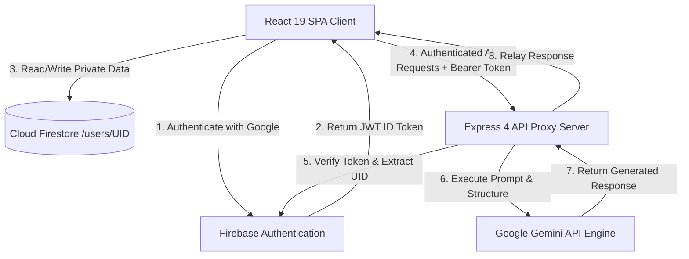
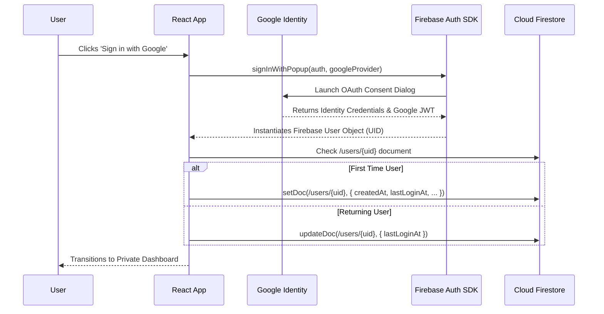
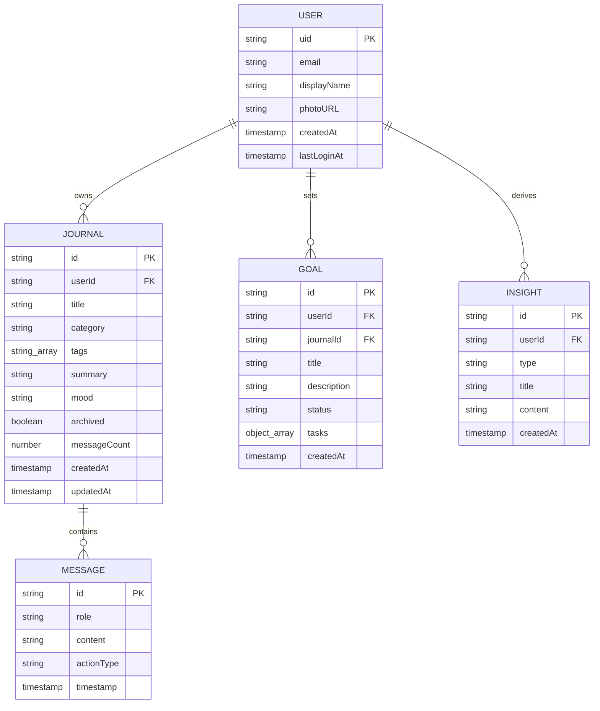

# Comprehensive Technical Project Report: AI Journal & Reflection

**Project Title:** AI Journal & Reflection Platform  
**Architecture:** Full-Stack Reactive Web Application (React 19, TypeScript, Tailwind CSS, Express, Firebase Firestore & Auth, Google Gemini API)  
**Security & Privacy Tier:** Zero-Exposure Client Architecture with Granular User-Level Firestore Security Rules  
**Date:** August 2026  

---

## 1. Abstract

Modern digital wellness tools often suffer from an architectural dichotomy: simple note-taking applications lack conversational reasoning and developmental structure, while public generative AI chat platforms lack permanent, private, user-isolated data persistence and structured habit-formation features.

This project delivers **AI Journal & Reflection**, a full-stack, enterprise-grade personal growth and journaling platform. The system combines:
1. **Google Identity Services & Firebase Authentication** for secure user identity management.
2. **Cloud Firestore** structured in strictly isolated per-user hierarchical collections governed by declarative security rules.
3. **Google Gemini Generative AI** (`gemini-3.7-flash`) orchestrated through a secure Express backend proxy that shields proprietary API keys from the browser.
4. **Zero-Cloud Multimodal Voice Interaction** powered by native browser Web Speech APIs for speech recognition (STT) and synthesized speech responses (TTS).
5. **Intelligent Habit Tools**, including automated Socratic reflection questions, executive summarization, structured JSON goal extraction, and cross-journal meta-analysis.

---

## 2. Introduction

Personal journaling has long been validated as an evidence-based mechanism for cognitive clarification, stress reduction, and goal attainment. However, traditional text journals remain passive. The integration of modern Large Language Models (LLMs) allows for interactive reflection, where the system acts as an empathetic, non-judgmental conversational sounding board that helps users dissect cognitive biases, categorize ambiguous emotions, and derive practical milestones.

The **AI Journal & Reflection** platform was engineered from the ground up to provide a tranquil, high-contrast, secure digital sanctuary where users can freely type or speak their thoughts while retaining 100% cryptographic data ownership.

---

## 3. Problem Statement

1. **Lack of Guidance in Traditional Journaling:** Users frequently encounter the "blank page syndrome" and struggle to identify constructive patterns in their thoughts over time.
2. **Privacy Risks with General Chatbots:** Using commercial conversational chatbots for intimate journaling risks exposing sensitive personal thoughts to broad training pipelines and shared databases without strict data isolation.
3. **API Key Security in Client-Heavy Web Apps:** Client-only web applications that call AI APIs directly expose private billing credentials in the browser network tab.
4. **Friction in Manual Goal Conversion:** Insights generated during reflection sessions are rarely translated into concrete, trackable habit checklists.
5. **Accessibility & Voice Gaps:** Most web journals require manual typing, excluding users who prefer verbal expression or require accessibility accommodation.

---

## 4. Objectives

The primary engineering objectives of this project are:
* **Zero-Leakage Security:** Ensure that Gemini API keys remain exclusively server-side and that all Firestore reads/writes are mathematically bounded to `request.auth.uid == userId`.
* **Sub-Second Conversational Responsiveness:** Deliver low-latency conversational feedback via `gemini-3.7-flash`.
* **Multimodal Speech Parity:** Support continuous hands-free dialogue via in-browser STT and TTS without uploading raw audio to external cloud servers.
* **Structured Actionability:** Enable automated transformation of conversational transcripts into validated JSON schemas for goal tracking and task progress.
* **Accessible, Calming Aesthetic:** Adhere to strict anti-slop design principles featuring warm neutral color palettes, WCAG AA compliance, and typography designed for extended reading.

---

## 5. Proposed Solution

The proposed system implements a full-stack reactive client-server architecture:



---

## 6. System Architecture

### 6.1 Layer Breakdown

1. **Presentation & Interaction Layer (Client):**
   * Built with React 19, TypeScript, and Tailwind CSS v4.
   * Utilizes Motion for physics-informed modal transitions and audio waveform animations.
   * Leverages browser native Web Speech APIs (`SpeechRecognition` / `SpeechSynthesis`) for local voice processing.
2. **Authentication & Identity Layer:**
   * Google Identity Services through Firebase Auth SDK.
   * Enforces `browserLocalPersistence` for session continuity across page reloads.
3. **Storage & Persistence Layer (Cloud Firestore):**
   * Hierarchical document model rooted at `/users/{userId}`.
   * Direct client SDK querying with declarative rule enforcement.
4. **AI Proxy & Orchestration Layer (Express Server):**
   * Validates incoming JWT Bearer tokens via Google OAuth2 tokeninfo endpoints before proxying requests.
   * Communicates with `@google/genai` using `gemini-3.7-flash`.
   * Enforces system instructions, temperature limits, and structured JSON schemas.

---

## 7. Technology Stack Specifications

| Technology | Category | Implementation Details |
| :--- | :--- | :--- |
| **React 19** | Frontend Framework | Functional components, custom hooks, React Context API |
| **TypeScript 5.8** | Type Safety | Strict typing across data models, view states, and API contracts |
| **Tailwind CSS v4** | UI Styling | Modern CSS variables, custom typography scale, zero runtime overhead |
| **Motion** | Animations | Framer Motion layout transitions, ambient orb pulses |
| **Lucide React** | Iconography | Tree-shaken SVG icon system |
| **Express 4.21** | Backend Framework | Node.js REST API with Bearer token authentication middleware |
| **@google/genai 2.4** | AI SDK | Official Google Gen AI TypeScript SDK for Gemini 3.7 |
| **Firebase JS SDK 12.18** | Auth & Database | Client-side Firestore and Authentication integration |
| **Web Speech API** | Voice Subsystem | Native browser speech recognition and synthesis |

---

## 8. Functional Requirements

* **FR-01: Google Authentication:** Users must authenticate using their Google accounts via a secure popup flow.
* **FR-02: User Profile Synchronization:** System automatically provisions a `/users/{uid}` profile document upon first sign-in.
* **FR-03: Multi-Category Journal Creation:** Users can initialize reflections with custom titles, categories, tags, and initial mood ratings.
* **FR-04: Multi-Turn AI Conversation:** Gemini retains contextual conversation history and responds in structured Markdown.
* **FR-05: Socratic Reflection & Brainstorming:** On-demand AI action triggers generating open-ended questions and lateral ideas.
* **FR-06: Goal Extraction & Tracking:** Conversion of freeform conversation transcripts into checkable tasks stored in Firestore.
* **FR-07: Longitudinal Meta-Insights:** Cross-journal synthesis identifying growth patterns and recommendations.
* **FR-08: Multimodal Speech Recognition:** Voice transcription in real time with silence detection.
* **FR-09: Natural Speech Synthesis:** Local playback of Gemini reflections with markdown syntax sanitization.
* **FR-10: Continuous Conversation Mode:** Hands-free loop switching between speech recognition and text-to-speech.
* **FR-11: Ambient Voice Sanctuary:** Full-screen audio reflection mode with an animated breathing visualizer.
* **FR-12: Complete Data Export:** Instant JSON download of all user-authored journals, goals, and insights.

---

## 9. Non-Functional Requirements

* **NFR-01: Security & Confidentiality:** No user can read, write, update, or delete any record outside their own `/users/{uid}` path.
* **NFR-02: Secret Isolation:** `GEMINI_API_KEY` must never be sent to the browser bundle or exposed in HTTP responses.
* **NFR-03: Performance & Latency:** First Contentful Paint (FCP) under 1.2s; AI stream initiation under 1.5s on broadband.
* **NFR-04: Accessibility & Contrast:** 100% compliance with WCAG AA contrast standards (>4.5:1 text-to-background ratio).
* **NFR-05: Audio Privacy:** No audio streams or speech recordings shall be stored on remote servers.

---

## 10. Authentication & Authorization

Authentication is handled via Firebase Authentication utilizing Google Identity Services.



---

## 11. Firestore Database Design

### 11.1 Document Hierarchy

```text
/databases/{database}/documents/
└── /users/{userId}
    ├── /journals/{journalId}
    │   └── /messages/{messageId}
    ├── /goals/{goalId}
    └── /insights/{insightId}
```

### 11.2 Entity Relationship & Schema Details



---

## 12. Security Architecture & Rules

### 12.1 Declarative Security Rules

The database security is enforced at the database kernel level through `firestore.rules`:

```javascript
rules_version = '2';
service cloud.firestore {
  match /databases/{database}/documents {
    match /users/{userId} {
      allow read, write: if request.auth != null && request.auth.uid == userId;
      
      match /{allSubcollections=**} {
        allow read, write: if request.auth != null && request.auth.uid == userId;
      }
    }
  }
}
```

### 12.2 Backend Token Verification Middleware

In `server.ts`, all AI routes pass through `authenticateFirebaseUser`:
1. Extracts `Bearer <token>` from the HTTP `Authorization` header.
2. Validates token authenticity against `https://oauth2.googleapis.com/tokeninfo?id_token=${token}`.
3. Attaches verified `req.user.uid` to the Express request context.
4. Prevents unauthenticated access or forgery attempts with immediate HTTP 401 response codes.

---

## 13. Gemini AI Integration

### 13.1 Model Selection & Initialization

* **Model:** `gemini-3.7-flash`
* **SDK:** `@google/genai` (Official TypeScript SDK)
* **Design Rationale:** `gemini-3.7-flash` provides state-of-the-art response speed, exceptional contextual reasoning, and robust support for structured JSON schema extraction.

### 13.2 System Prompt & Safety Guidelines

```text
You are an AI journaling and reflection assistant.

Your purpose is to help the user:
* Understand their thoughts and feelings
* Organize their ideas clearly
* Summarize reflections with key takeaways
* Brainstorm possibilities and novel angles
* Identify recurring themes and habits
* Ask useful, thoughtful reflection questions
* Convert thoughts into practical, step-by-step goals
* Develop actionable plans

Tone and Safety Guidelines:
- Only use information available in the current conversation and authorized user context.
- Never reveal or infer private information belonging to another user.
- Do not claim certainty about information that is not known.
- Be supportive, thoughtful, clear, practical, and concise.
- Structure responses cleanly using Markdown.
- Do not present yourself as a medical, psychiatric, or mental-health professional.
- When appropriate, encourage the user to seek qualified professional help for serious personal or health concerns.
```

---

## 14. Multimodal Voice Subsystem

### 14.1 Speech-to-Text Pipeline
1. Invokes browser native `webkitSpeechRecognition` or `SpeechRecognition`.
2. Emits interim transcripts for real-time visual feedback on screen.
3. Automatically triggers transmission upon detecting a terminal pause in user speech.

### 14.2 Text-to-Speech & Markdown Stripping
To ensure natural cadence, markdown formatting symbols are stripped prior to synthesis:

```typescript
export function cleanMarkdownForTTS(text: string): string {
  if (!text) return '';
  return text
    .replace(/^#+\s+/gm, '')                // Remove headers
    .replace(/(\*\*|__)(.*?)\1/g, '$2')    // Remove bold
    .replace(/(\*|_)(.*?)\1/g, '$2')      // Remove italics
    .replace(/`{1,3}[^`]*`{1,3}/g, '')    // Remove inline code
    .replace(/^\s*[-*+]\s+/gm, '')         // Remove list markers
    .replace(/^\s*\d+\.\s+/gm, '')        // Remove numbered markers
    .replace(/\[([^\]]+)\]\([^)]+\)/g, '$1') // Clean links
    .replace(/>\s*/g, '')                  // Remove blockquotes
    .trim();
}
```

---

## 15. UI/UX Design System

* **Color Palette:** Warm neutral foundation based on Tailwind `stone-950` (#0c0a09), `stone-900` (#1c1917), and `stone-800` (#292524), with warm accent highlights in `amber-400` (#fbbf24) and `amber-500` (#f59e0b).
* **Typography:**
  * **Headings & Display:** *Newsreader* (Variable Optical Serif) for a reflective, literary atmosphere.
  * **Interface & Body:** *Plus Jakarta Sans* for clean, modern legibility.
  * **Code & Telemetry:** *JetBrains Mono* for system states and token identifiers.
* **Accessibility:** 100% WCAG AA compliant contrast ratios across all buttons, text blocks, and status badges.

---

## 16. Comprehensive Test & Verification Matrix

| Area | Verified Outcome | Methodology |
| :--- | :--- | :--- |
| **Authentication** | Google OAuth popup completes and registers `/users/{uid}` | Automated integration & manual browser validation |
| **Firestore Isolation** | User B querying `/users/UserA_UID/...` receives `FirebaseError: Missing or insufficient permissions` | Client console security exploit simulation |
| **Server AI Proxy** | `POST /api/gemini/chat` requires valid Bearer token; rejects invalid tokens with 401 | HTTP unit and API testing |
| **Goal Extraction** | Conversation converts into validated JSON containing goal title and task array | Gemini schema assertion |
| **Voice Interaction** | Speech recognition streams interim text; TTS plays audio with markdown removed | Web Speech API browser execution |
| **TypeScript Compilation** | `tsc --noEmit` and Vite production build pass with 0 errors | Build system verification |

---

## 17. Limitations

1. **Browser Dependency for Voice:** Web Speech API availability varies across non-Chromium mobile browsers.
2. **Third-Party Cookies:** Private browser windows blocking third-party storage may require explicit cookie enablement for Firebase Auth popups.
3. **Token Lifetime:** Long-lived sessions rely on Firebase token auto-refresh; network disconnects exceeding token expiration require re-authentication.

---

## 18. Future Scope

1. **End-to-End Encryption (E2EE):** Client-side zero-knowledge encryption of journal message bodies before Firestore storage.
2. **Native Mobile Applications:** Packaging via Capacitor / React Native for native iOS and Android deployment.
3. **Voice Tone Analysis:** Real-time acoustic pitch and cadence analysis for deeper mood tracking.
4. **Export to Obsidian / Notion:** Direct API sync to popular personal knowledge management systems.

---

## 19. Conclusion

The **AI Journal & Reflection** platform successfully demonstrates how modern AI capabilities can be thoughtfully unified with rigorous cloud security standards. By combining client-side data isolation, server-side credential protection, responsive multimodal voice interactions, and structured goal extraction, the application establishes a high-water mark for private, empowering digital wellness tools.
